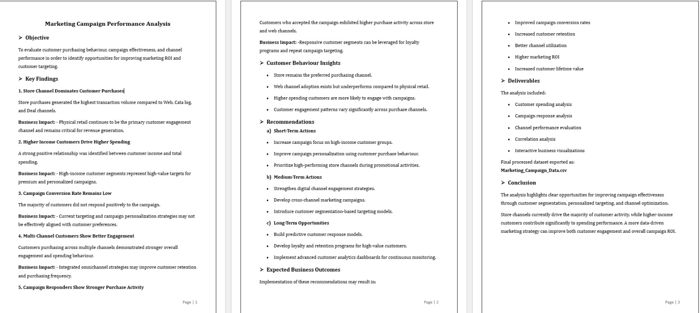
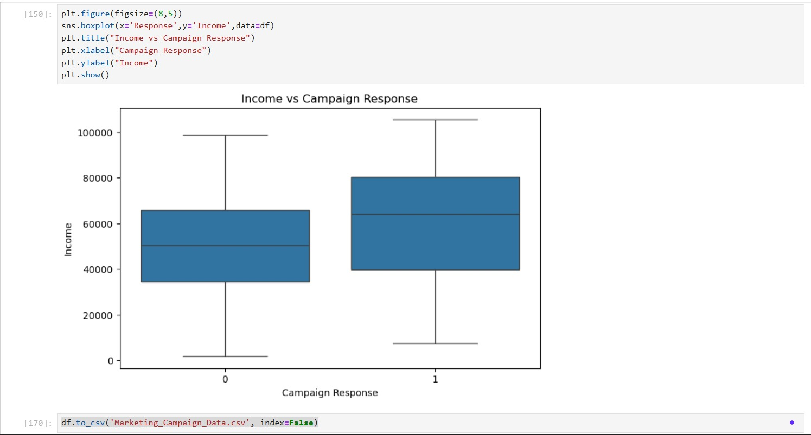
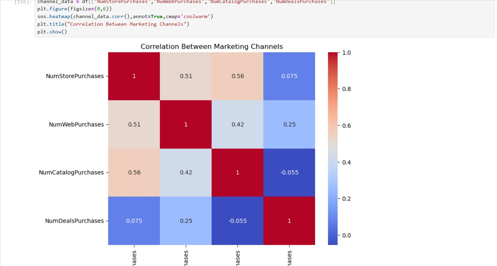

# SCT_DA_4

Marketing data analysis project using Python, Pandas, Plotly, and Seaborn to evaluate customer behavior, campaign response, and marketing ROI.

## Project Overview
This project focuses on analyzing customer purchasing behavior, campaign effectiveness, and marketing channel performance using Python-based data analysis techniques.

The objective of the analysis is to identify opportunities for improving customer targeting, campaign engagement, and overall marketing ROI through data-driven insights.

---

# Objectives
- Analyze customer purchasing behavior
- Evaluate campaign effectiveness
- Compare marketing channel performance
- Understand customer engagement patterns
- Identify the need for Machine Learning in marketing strategy

---

# Technologies Used
- Python
- Pandas
- NumPy
- Matplotlib
- Seaborn
- Plotly

---

# Dataset Information
The dataset contains:
- Customer demographics
- Customer spending behavior
- Marketing channel purchases
- Campaign response data

---

# Project Report

---

# Visualizations

## 1. Marketing Channel Performance
Shows comparison between Store, Web, Catalog, and Deal purchases.

---

## 2. Campaign Response Distribution
Shows accepted vs rejected campaign responses.

---

## 3. Income vs Campaign Response
Analyzes income distribution across campaign response groups.

---

## 4. Correlation Between Marketing Channels
Shows relationships between Store, Web, Catalog, and Deal purchases.

---

## 5. Purchases by Campaign Response
Compares purchasing behavior of customers who accepted and rejected campaigns.

---

# Key Findings
- Store purchases generated the highest transaction volume.
- Higher-income customers demonstrated stronger spending behavior.
- Campaign conversion rates remain relatively low.
- Customers responding positively to campaigns showed stronger purchase activity.
- Marketing channels influence customer behavior differently.

---

# Why Machine Learning is Needed
Machine Learning is needed because customer behavior patterns vary significantly across purchasing channels and campaign responses.

ML models can help:
- Predict customer responses
- Improve marketing targeting
- Increase campaign conversion rates
- Optimize marketing ROI
- Personalize customer engagement

---

# Business Recommendations
- Focus marketing investment on high-performing channels.
- Improve campaign personalization strategies.
- Develop customer segmentation models.
- Strengthen digital engagement strategies.
- Use predictive analytics for smarter targeting.

---

# Files Included
- `SCT_DA_4.ipynb`
- `SCT_DA_4.docx`
- `Marketing_data.csv`
- Visualization Charts
- README.md

---

# Conclusion
This project demonstrates how data analysis and visualization can support marketing strategy optimization. The findings highlight the importance of customer segmentation, channel analysis, and predictive modeling for improving overall campaign effectiveness and marketing ROI.

---

# Author
Sujal Narge  
MBA Student | Data Analytics & Business Analysis Enthusiast
